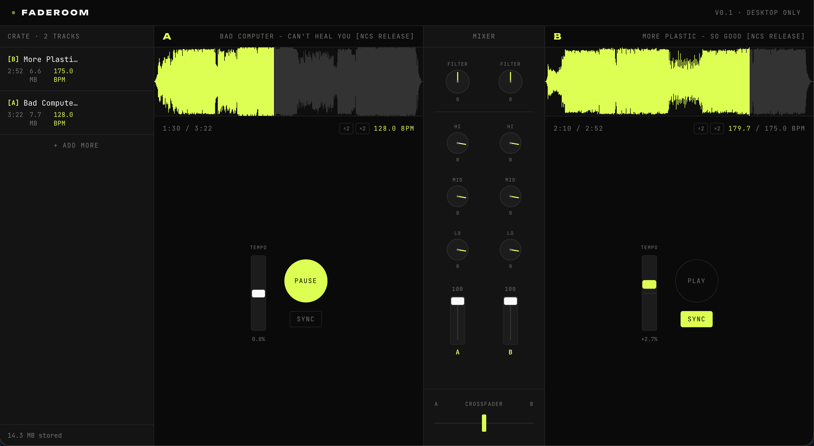

# Faderoom

A browser-based DJ mixer built with the Web Audio API.

**Try it:** [faderoom-ten.vercel.app](https://faderoom-ten.vercel.app)

Load MP3s into two decks, beat-match, EQ, filter sweep, and crossfade — entirely client-side, no uploads, no servers, no accounts.



## Why

Most "browser DJ" apps that connect to Spotify are visual theater — they crossfade volumes between tracks because the Spotify SDK won't let them touch the audio stream. No real beat matching, no real EQ, no real filter, just cosmetics over a swap.

Faderoom uses raw Web Audio on user-provided MP3s, so the mixing is real: tempo-shifted playback, biquad-filter EQ, logarithmic filter sweeps, equal-power crossfade curves. The result is a DJ instrument that runs entirely in the browser tab and behaves like one.

## Features

- **Persistent crate** — drag MP3s in, they stay across sessions via IndexedDB
- **Two decks** with independent playback, waveforms, and full audio chains
- **Scrolling waveforms** — peak envelopes rendered to canvas, click to seek, drag to scrub
- **Three-band EQ per deck** — high shelf at 10kHz, peaking mid at 1kHz, low shelf at 220Hz, asymmetric range (-40dB to +6dB) for proper DJ kills
- **Filter knob per deck** — bipolar control sweeps a biquad filter between lowpass (20kHz→200Hz) and highpass (20Hz→8kHz) with a logarithmic frequency curve and a 5% dead zone at center
- **Crossfader** with an equal-power (cosine/sine) curve so the combined volume stays perceptually constant
- **Channel volume faders** with smooth interpolation and double-click reset
- **BPM detection** via `web-audio-beat-detector`, cached to IndexedDB so analysis runs once per track
- **Half/double BPM correction** per deck for misdetected tracks (multipliers are deck-scoped, not track-scoped)
- **SYNC** — automatic tempo matching via playback rate adjustment, accounting for both decks' BPM multipliers
- **Tempo slider per deck** — ±10% manual pitch range with `linearRampToValueAtTime` smooth ramps; double-click triggers a 3-second glide back to native tempo (the classic "ride the pitch back" technique after a transition)

## Stack

- **Framework:** Next.js 16 (App Router, TypeScript)
- **Styling:** Tailwind CSS v4
- **State:** Zustand
- **Audio engine:** Web Audio API (no external audio libraries beyond BPM detection)
- **Storage:** IndexedDB (raw MP3 bytes + cached BPM metadata)
- **Fonts:** JetBrains Mono, Unbounded
- **Deploy:** Vercel

## Audio architecture

Each deck owns a graph of Web Audio nodes:
```
AudioBufferSourceNode
→ BiquadFilterNode (high shelf)
→ BiquadFilterNode (mid peaking)
→ BiquadFilterNode (low shelf)
→ BiquadFilterNode (lowpass/highpass filter, type-switched on the fly)
→ GainNode (channel volume)
→ GainNode (crossfade contribution)
→ destination
```
The engine creates this graph once per deck and reuses it across track loads. New tracks replace the source buffer; the rest of the chain stays put. All parameter changes use `setTargetAtTime` for click-free interpolation, and tempo changes use `linearRampToValueAtTime` for smooth glides.

Memory architecture matters here: a decoded 4-minute MP3 is ~40MB of raw PCM in an AudioBuffer. Faderoom decodes once for peak/BPM analysis, stores the **raw MP3 bytes** in IndexedDB, discards the AudioBuffer, and re-decodes from the cached bytes when a track is loaded to a deck. This keeps memory bounded regardless of crate size.

## Custom components

Every interactive control is hand-built — no slider/knob libraries:

- **`Knob`** — rotary control with pointer capture, double-click reset, shift-hold for fine adjustment. Used for EQ and filter.
- **`VerticalFader`** — custom thumb-on-track, same interaction pattern. Used for channel volumes.
- **`TempoSlider`** — bipolar variant of the fader with smooth ramp-back on double-click.
- **`Waveform`** — Canvas rendering of pre-extracted peak data, DPR-aware, with click-to-seek and drag-to-scrub.

## Known limitations (v1)

- **No keylock.** SYNC and the tempo slider adjust playback rate, which pitch-shifts the audio. True pitch-independent tempo change (keylock / master tempo) requires a phase-vocoder library like `soundtouch-js` and is planned for v2.
- **No beat-grid alignment.** SYNC matches tempos but doesn't auto-align downbeats. You still need to start the second deck on the right beat by ear. `web-audio-beat-detector` only returns BPM, not beat offset times.
- **BPM detection accuracy varies.** Strong 4-on-the-floor tracks (house, techno, dnb) detect very reliably. Hip-hop, ambient, and weakly-rhythmic music can detect at half or double tempo. Hence the ÷2/×2 buttons.
- **Desktop-only.** The layout assumes ≥1024px width. Phones get a "come back on desktop" splash.

## Running locally

```bash
git clone https://github.com/yourusername/faderoom.git
cd faderoom
npm install
npm run dev
```

Open [http://localhost:3000](http://localhost:3000). You'll need to drag your own MP3s into the crate. Good sources for royalty-free tracks with strong beats: [NCS](https://ncs.io/), [Free Music Archive](https://freemusicarchive.org/).

## License

MIT